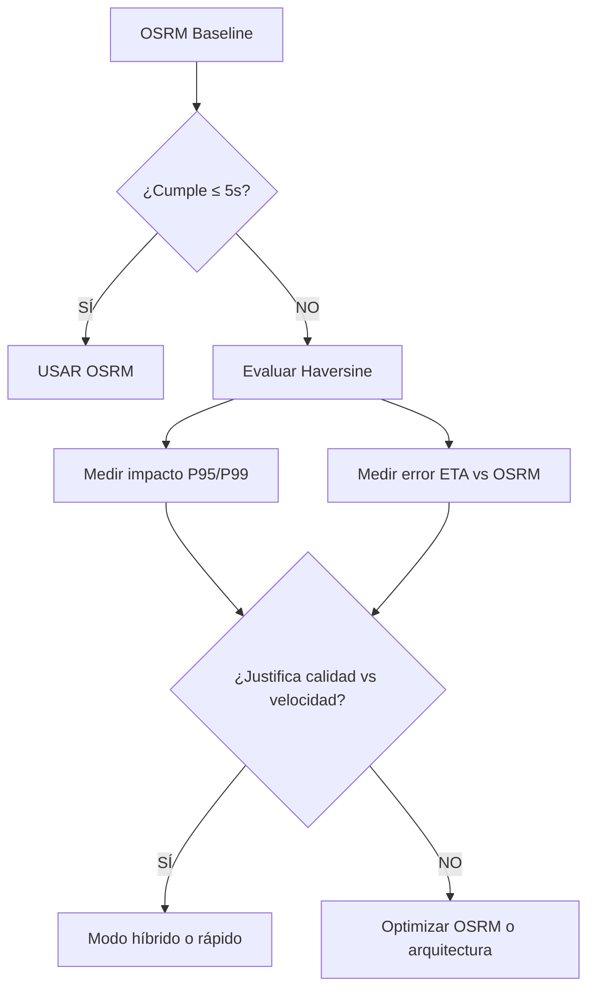

```mermaid
graph TD
    A[OSRM Baseline] --> B{¿Cumple ≤ 5s?}
    B -->|SÍ| C[USAR OSRM]
    B -->|NO| D[Evaluar Haversine]
    D --> E[Medir impacto P95/P99]
    D --> F[Medir error ETA vs OSRM]
    E --> G{¿Justifica calidad vs velocidad?}
    F --> G
    G -->|SÍ| H[Modo híbrido o rápido]
    G -->|NO| I[Optimizar OSRM o arquitectura]
```