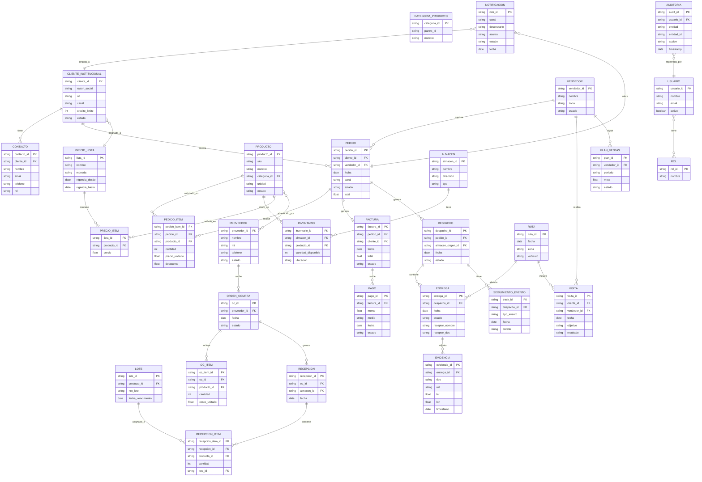

```mermaid
erDiagram

  CLIENTE_INSTITUCIONAL {
    string cliente_id PK
    string razon_social
    string nit
    string canal
    int credito_limite
    string estado
  }

  CONTACTO {
    string contacto_id PK
    string cliente_id FK
    string nombre
    string email
    string telefono
    string rol
  }

  VENDEDOR {
    string vendedor_id PK
    string nombre
    string zona
    string estado
  }

  PLAN_VENTAS {
    string plan_id PK
    string vendedor_id FK
    string periodo
    float meta
    string estado
  }

  PRODUCTO {
    string producto_id PK
    string sku
    string nombre
    string categoria_id FK
    string unidad
    string estado
  }

  CATEGORIA_PRODUCTO {
    string categoria_id PK
    string parent_id
    string nombre
  }

  PROVEEDOR {
    string proveedor_id PK
    string nombre
    string nit
    string telefono
    string estado
  }

  PRECIO_LISTA {
    string lista_id PK
    string nombre
    string moneda
    date vigencia_desde
    date vigencia_hasta
  }

  PRECIO_ITEM {
    string lista_id FK
    string producto_id FK
    float precio
  }

  ALMACEN {
    string almacen_id PK
    string nombre
    string direccion
    string tipo
  }

  INVENTARIO {
    string inventario_id PK
    string almacen_id FK
    string producto_id FK
    int cantidad_disponible
    string ubicacion
  }

  LOTE {
    string lote_id PK
    string producto_id FK
    string nro_lote
    date fecha_vencimiento
  }

  PEDIDO {
    string pedido_id PK
    string cliente_id FK
    string vendedor_id FK
    date fecha
    string canal
    string estado
    float total
  }

  PEDIDO_ITEM {
    string pedido_item_id PK
    string pedido_id FK
    string producto_id FK
    int cantidad
    float precio_unitario
    float descuento
  }

  FACTURA {
    string factura_id PK
    string pedido_id FK
    string cliente_id FK
    date fecha
    float total
    string estado
  }

  PAGO {
    string pago_id PK
    string factura_id FK
    float monto
    string medio
    date fecha
    string estado
  }

  DESPACHO {
    string despacho_id PK
    string pedido_id FK
    string almacen_origen_id FK
    date fecha
    string estado
  }

  RUTA {
    string ruta_id PK
    date fecha
    string zona
    string vehiculo
  }

  ENTREGA {
    string entrega_id PK
    string despacho_id FK
    date fecha
    string estado
    string receptor_nombre
    string receptor_doc
  }

  EVIDENCIA {
    string evidencia_id PK
    string entrega_id FK
    string tipo
    string url
    float lat
    float lon
    date timestamp
  }

  VISITA {
    string visita_id PK
    string cliente_id FK
    string vendedor_id FK
    date fecha
    string objetivo
    string resultado
  }

  ORDEN_COMPRA {
    string oc_id PK
    string proveedor_id FK
    date fecha
    string estado
  }

  OC_ITEM {
    string oc_item_id PK
    string oc_id FK
    string producto_id FK
    int cantidad
    float costo_unitario
  }

  RECEPCION {
    string recepcion_id PK
    string oc_id FK
    string almacen_id FK
    date fecha
  }

  RECEPCION_ITEM {
    string recepcion_item_id PK
    string recepcion_id FK
    string producto_id FK
    int cantidad
    string lote_id FK
  }

  USUARIO {
    string usuario_id PK
    string nombre
    string email
    boolean activo
  }

  ROL {
    string rol_id PK
    string nombre
  }

  AUDITORIA {
    string audit_id PK
    string usuario_id FK
    string entidad
    string entidad_id
    string accion
    date timestamp
  }

  NOTIFICACION {
    string noti_id PK
    string canal
    string destinatario
    string asunto
    string estado
    date fecha
  }

  SEGUIMIENTO_EVENTO {
    string track_id PK
    string despacho_id FK
    string tipo_evento
    date fecha
    string detalle
  }


  CLIENTE_INSTITUCIONAL ||--o{ CONTACTO : "tiene"
  CLIENTE_INSTITUCIONAL ||--o{ PEDIDO : "realiza"
  CLIENTE_INSTITUCIONAL }o--|| PRECIO_LISTA : "asignada_a"

  VENDEDOR ||--o{ PEDIDO : "captura"
  VENDEDOR ||--o{ VISITA : "realiza"
  VENDEDOR ||--o{ PLAN_VENTAS : "sigue"

  PRODUCTO ||--o{ PEDIDO_ITEM : "solicitado_en"
  PEDIDO ||--o{ PEDIDO_ITEM : "incluye"
  PEDIDO ||--o| FACTURA : "genera"
  FACTURA ||--o{ PAGO : "recibe"

  PEDIDO ||--o{ DESPACHO : "genera"
  DESPACHO ||--o{ ENTREGA : "contiene"
  ENTREGA ||--o{ EVIDENCIA : "adjunta"
  RUTA ||--o{ ENTREGA : "atiende"
  RUTA ||--o{ VISITA : "incluye"
  DESPACHO ||--o{ SEGUIMIENTO_EVENTO : "tiene"

  ALMACEN ||--o{ INVENTARIO : "tiene"
  PRODUCTO ||--o{ INVENTARIO : "stock_de"
  LOTE ||--o{ RECEPCION_ITEM : "asignado_a"

  PROVEEDOR ||--o{ ORDEN_COMPRA : "recibe"
  ORDEN_COMPRA ||--o{ OC_ITEM : "incluye"
  ORDEN_COMPRA ||--o{ RECEPCION : "genera"
  RECEPCION ||--o{ RECEPCION_ITEM : "contiene"

  PRECIO_LISTA ||--o{ PRECIO_ITEM : "contiene"
  PRODUCTO ||--o{ PRECIO_ITEM : "tarifado_en"

  PRODUCTO }o--o{ PROVEEDOR : "abastecido_por"

  USUARIO }o--o{ ROL : "tiene"
  AUDITORIA }o--|| USUARIO : "registrada_por"

  NOTIFICACION }o--|| CLIENTE_INSTITUCIONAL : "dirigida_a"
  NOTIFICACION }o--|| PEDIDO : "sobre"
```